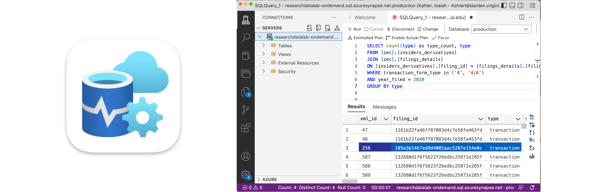

---
next:
  text: Next Thing
  link: /guides/get-connected
---

# Making a Query

<!-- :::: info Prerequisites
1. [Request access to the Data Lab](https://servicedesk.darden.virginia.edu/support/catalog/items/90?target=_blank) using your Darden Microsoft account. At this time, only the Darden faculty and select staff are eligible for access to the platform. Once you've been approved by administrators, you'll receive an email and gain the ability to log in. 
:::: -->

Once you have gained access to the Research Data Lab, you can connect and make queries through one of the following ways:

## Using a SQL Client

A SQL client is a software application that directly connects to the server, sends your request, fetches the result, and displays the output. These apps are great for exploring data, making visualizations, exporting results, and more. 

<!-- The recommended SQL application for connecting to the Research Data Lab is [Azure Data Studio](https://azure.microsoft.com/en-us/products/data-studio), a cross-platform tool made by Microsoft. Azure Data Studio comes packaged with necessary drivers and libraries for getting started quickly. You may also use other client apps that support SQL Server, like [SQL Server Management Studio](https://learn.microsoft.com/en-us/sql/ssms/download-sql-server-management-studio-ssms?view=sql-server-ver16).  -->

<CenterLevel>
  <ActionButton href='./using-a-sql-client' target=''>Query Using a SQL Client</ActionButton>
</CenterLevel>

## Using a Programming Language 

<!-- You can also make SQL queries from different programming languages by using drivers and language adapters (libraries). By using SQL within your programming language, your results are automatically converted into dataframes that are ready for further analysis.  -->

You can also make SQL queries from different programming languages by using drivers and language adapters (libraries). The benefit is that your query result is automatically converted into familiar dataframes and programming objects. 

<CenterLevel>
  <ActionButton href='./using-a-sql-client' target=''>Query Using Python</ActionButton>
  <ActionButton href='./using-a-sql-client' target=''>Query Using R</ActionButton>
</CenterLevel>